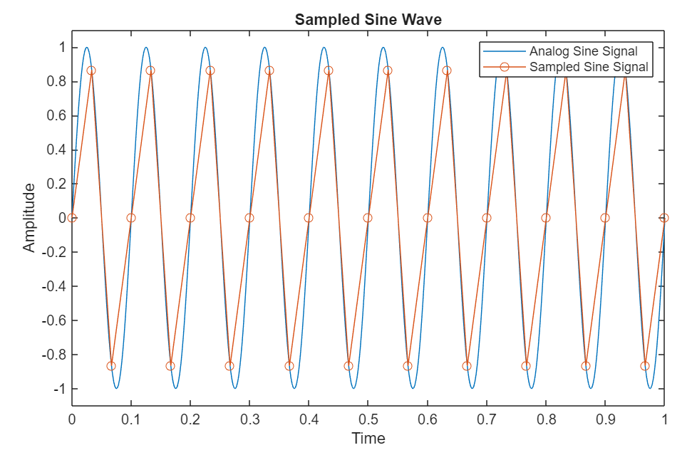
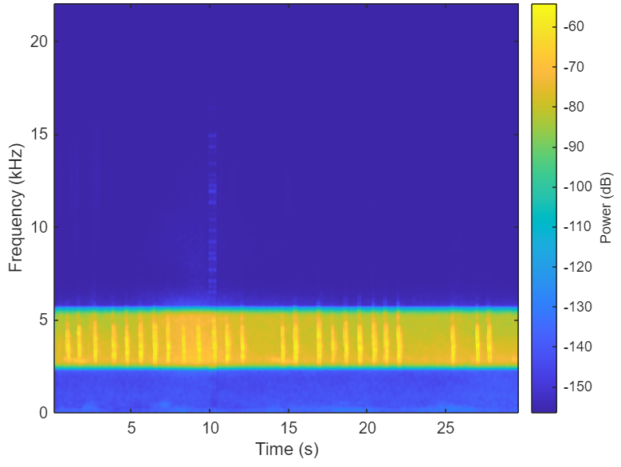
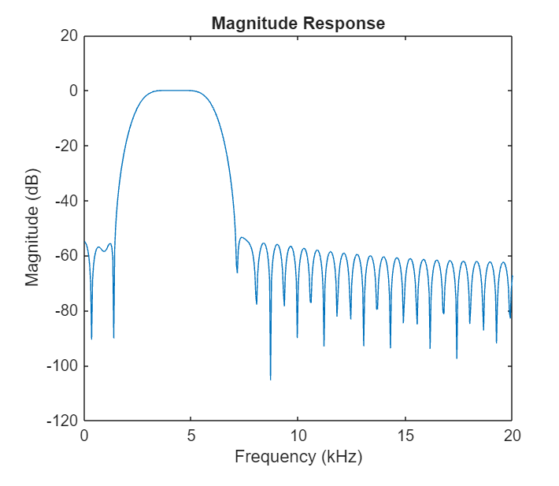
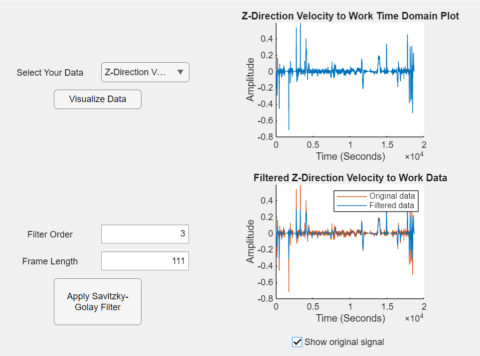
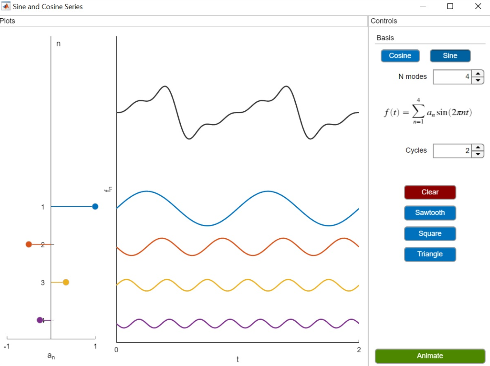

# Digital Signal Processing: Signals and Filter Design

**Curriculum Module**

_Created with R2024a. Compatible with R2024a and later releases._

# Information

This curriculum module is comprised of interactive [MATLAB® live scripts](https://www.mathworks.com/products/matlab/live-editor.html) and apps containing examples, exercises, and visualizations of key signal processing concepts.

## Background

You can use these live scripts as demonstrations in lectures, class activities, or interactive assignments outside class. This module covers analog to digital conversion, visualizing signals, basic filtering concepts, filter design, and app building. It also includes examples of analog to digital conversion and filtering using real\-world audio signals, and walks the learner through building their own filtering app.

The instructions inside the live scripts will guide you through the exercises and activities. Get started with each live script by running it one section at a time. To stop running the script or a section midway (for example, when an animation is in progress), use the  Stop button in the **RUN** section of the **Live Editor** tab in the MATLAB Toolstrip.

## Contact Us

Solutions are available upon instructor request. Contact the [MathWorks teaching resources team](mailto:onlineteaching@mathworks.com) if you would like to request solutions, provide feedback, or if you have a question.

## Prerequisites

This module assumes very basic knowledge of Fourier analysis and convolution. If you would like to refresh your knowledge on these concepts, consider checking out [this Fourier Analysis courseware module](https://matlab.mathworks.com/open/github/v1?repo=MathWorks-Teaching-Resources/Fourier-Analysis&project=fourier-analysis.prj) and [this live script covering convolution](https://matlab.mathworks.com/open/github/v1?repo=MathWorks-Teaching-Resources/Convolution-Digital-Signal-Processing&project=Convolution.prj&file=ConvolutionFilters.mlx) as it relates to filtering.

## Getting Started
### Accessing the Module
### **On MATLAB Online:**

Use the  link to download the module. You will be prompted to log in or create a MathWorks® account. The project will be loaded, and you will see an app with several navigation options to get you started.

### **On Desktop:**

Download or clone this repository. Open MATLAB, navigate to the folder containing these scripts and double\-click on [DSP.prj](https://matlab.mathworks.com/open/github/v1?repo=MathWorks-Teaching-Resources/Introduction-To-Digital-Signal-Processing&project=DSP.prj). It will add the appropriate files to your MATLAB path and open an app that asks you where you would like to start. 

Ensure you have all the required products ([listed below](#H_E850B4FF)) installed. If you need to include a product, add it using the Add\-On Explorer. To install an add\-on, go to the **Home** tab and select   **Add-Ons** > **Get Add-Ons**. 

## Products

MATLAB® is used throughout. Tools from Signal Processing Toolbox™ are used frequently as well.

# Scripts

 *If you are viewing this in a version of MATLAB prior to R2023b, you can view the learning outcomes for each script* [*here*](https://www.mathworks.com/matlabcentral/fileexchange/REPO_NAME)

## [**AnalogToDigitalConversion.mlx**](AnalogToDigitalConversion.mlx)
|     | **In this script, students will...**    -  Learn the difference between analog and digital signals    -  Explore examples of sampling signals at different sample rates    -  Learn about Nyquist Theorem and why it is important    -  Work through an example illustrating the effects of sampling and quantization on a short recording of a jazz song     |
| :-- | :-- |

## [**FilteringIntro.mlx**](FilteringIntro.mlx)
|     | **In this script, students will...**    -  Learn about the purpose of filtering    -  Explore a step\-by\-step example of applying a smoothing filter to real\-world accelerometer data    -  Learn about four different ways of visualizing signals in different domains    -  Learn about three different types of frequency\-based filters and apply them to a real\-world recording of birds chirping     |
| :-- | :-- |

## [**FilterDesign.mlx**](FilterDesign.mlx)
|     | **In this script, students will...**    -  Learn about impulse responses and their importance in designing filters    -  Learn the difference between FIR and IIR filters and apply them to an audio signal    -  Explore the importance of group delay and magnitude responses    -  Use the Design Filter live task to design their own filters     |
| :-- | :-- |

## [**BuildFilteringApp.mlx**](BuildFilteringApp.mlx)
|     | **In this script, students will...**    -  Work step by step to build a filtering app     |
| :-- | :-- |

# License

The license for this module is available in the [LICENSE.md](https://github.com/MathWorks-Teaching-Resources/Introduction-To-Digital-Signal-Processing/blob/release/LICENSE.md).

# Related Courseware Modules

## [Fourier Analysis](https://www.mathworks.com/matlabcentral/fileexchange/106725-fourier-analysis)
|     | **Available on:**           [GitHub](https://github.com/MathWorks-Teaching-Resources/Fourier-Analysis)      |
| :-- | :-- |

## [Convolution in Digital Signal Processing](https://www.mathworks.com/matlabcentral/fileexchange/97112-convolution-in-digital-signal-processing)
|     | **Available on:**           [GitHub](https://github.com/MathWorks-Teaching-Resources/Convolution-Digital-Signal-Processing)      |
| :-- | :-- |

Or feel free to explore our other [modular courseware content](https://www.mathworks.com/matlabcentral/fileexchange/?q=tag%3A%22courseware+module%22&sort=downloads_desc_30d).

# Educator Resources
-  [Educator Page](https://www.mathworks.com/academia/educators.html) 

# Contribute 

Looking for more? Find an issue? Have a suggestion? Please contact the [MathWorks teaching resources team](mailto:%20onlineteaching@mathworks.com). If you want to contribute directly to this project, you can find information about how to do so in the [CONTRIBUTING.md](https://github.com/MathWorks-Teaching-Resources/Introduction-To-Digital-Signal-Processing/blob/release/CONTRIBUTING.md) page on GitHub.

 *©* Copyright 2024 The MathWorks, Inc

